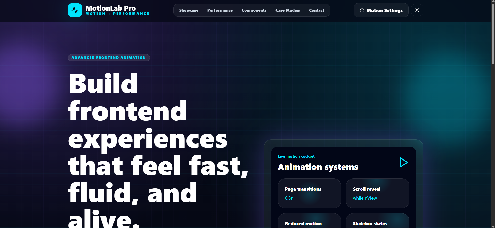
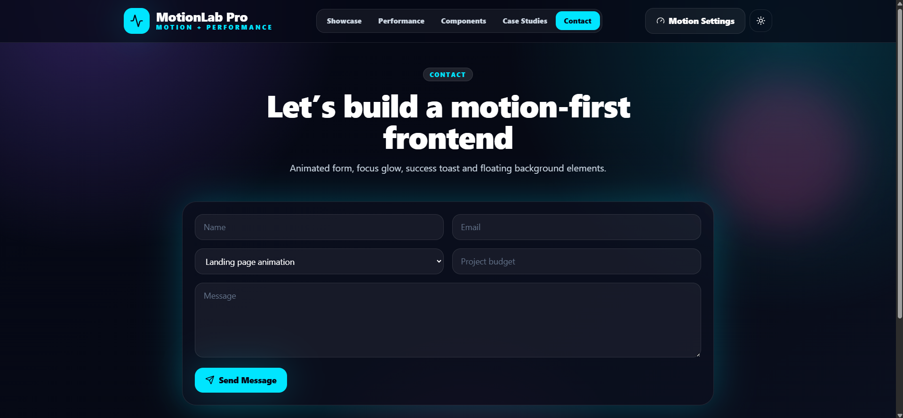
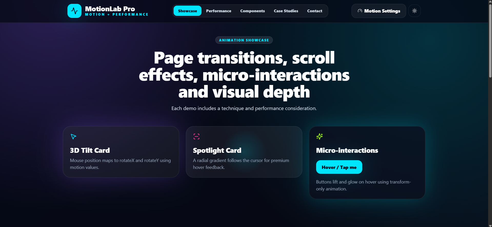
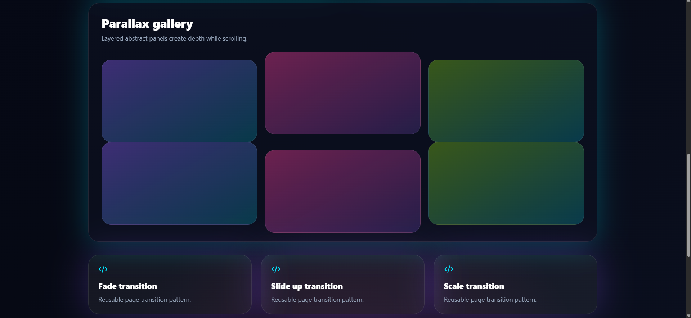
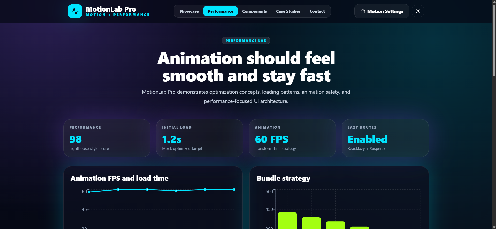
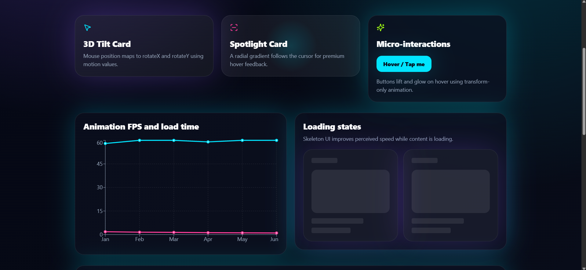
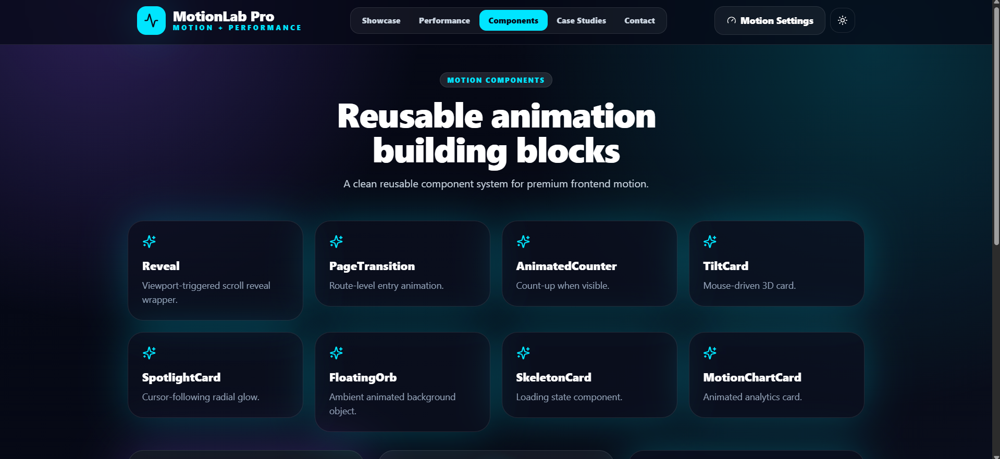
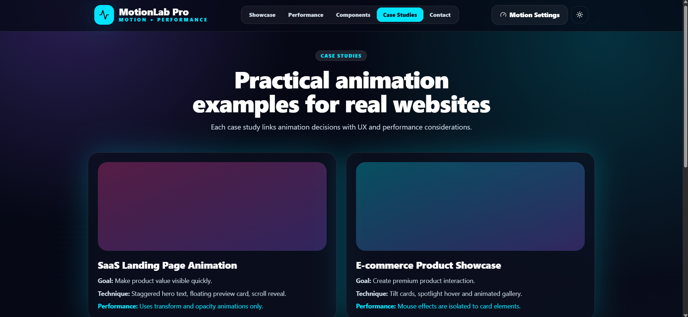
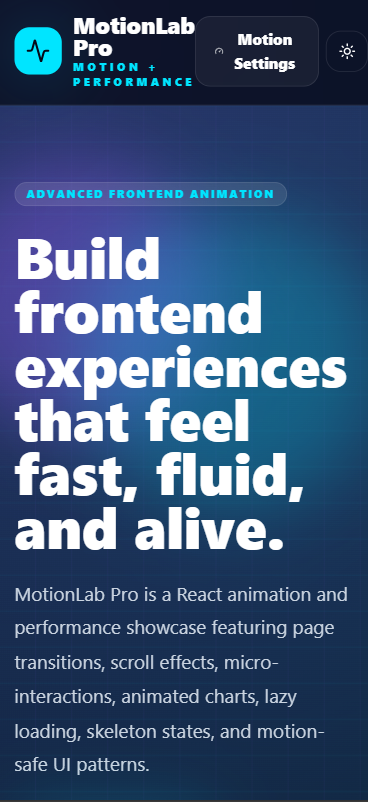
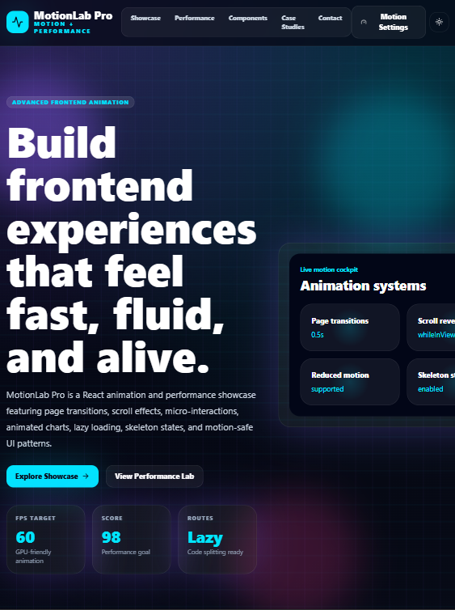

# MotionLab Pro — Advanced Frontend Animation & Performance Website

MotionLab Pro is an advanced React + TypeScript frontend animation and performance showcase. It demonstrates premium UI motion, route transitions, scroll animations, micro-interactions, animated cards, parallax sections, skeleton loading states, lazy-loaded routes, animated charts, and motion-safe accessibility patterns.

## Features

### Pages

- Home
- Showcase
- Performance Lab
- Motion Components
- Case Studies
- Contact

### Animation Techniques

- Page transitions with Framer Motion
- Scroll reveal animations
- Staggered card animations
- Animated hero text
- Floating objects
- Button micro-interactions
- 3D tilt card
- Spotlight hover card
- Parallax gallery
- Animated counters
- Animated charts
- Skeleton loading
- Lazy-loaded route demos
- Reduced-motion focused settings panel

### Performance Techniques

- React.lazy route splitting
- Suspense fallback
- Skeleton loading states
- Transform/opacity based animation
- Reusable motion variants
- Avoiding layout-heavy animations
- Responsive animation behavior
- Motion settings panel
- Reduced-motion awareness

## Tech Stack

- React
- TypeScript
- Vite
- Tailwind CSS
- React Router DOM
- Framer Motion
- Lucide React
- Recharts
- React Hot Toast
- date-fns-ready structure

## Installation

```bash
npm install
npm run dev
```

## Build

```bash
npm run build
npm run preview
```

## Screenshots

Create a `screenshots/` folder and add:

## Screenshots

Create a `screenshots/` folder and add:

## Screenshots

### Homepage



### contact



### showcase



### parallax-gallery



### performance



### loading-states



### components



### case-studies



### Mobile View



### Tablet View



## Future Improvements

- GSAP timeline demos
- Lenis smooth scrolling
- React Three Fiber 3D section
- Lottie animation integration
- Real Lighthouse report screenshots
- Storybook for motion components
- Playwright visual testing
- Animation presets package
- Theme editor
- Motion recording/playback demo

## Author

**Nasir Uddin Khan**  
Frontend Developer | React, TypeScript & Full-Stack Web Application Enthusiast

Designed and developed as a professional frontend portfolio project to demonstrate motion architecture, animation performance, smooth UI interaction, reusable motion components, and accessibility-aware frontend patterns.

- GitHub: [nasir050298](https://github.com/nasir050298)
- Email: nasiruddin@mails.cust.edu.cn
